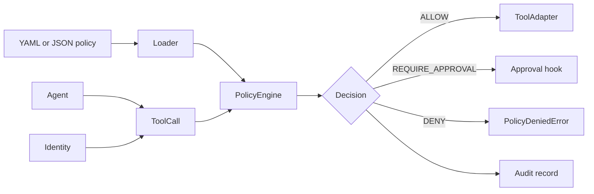
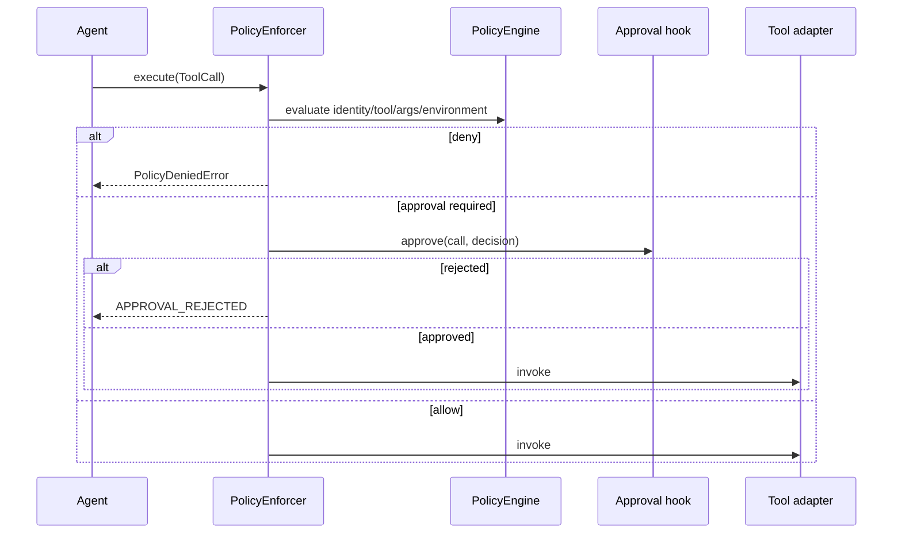

# Agent Policy Engine

Agent Policy Engine is a local, deny-by-default enforcement layer for AI tool calls. It combines identity, roles, attributes, environment, arguments, risk approval, and per-subject quotas into deterministic `ALLOW`, `DENY`, or `REQUIRE_APPROVAL` decisions.

## Problem Statement

Tool discovery is not authorization. A model selecting a tool does not prove that its user may invoke it, that its arguments are safe, or that an approval and quota have been satisfied.

## What This Project Solves

- typed policy rules loaded from YAML or JSON
- RBAC and equality-based ABAC
- environment restrictions
- required, equality, membership, numeric, and regex argument constraints
- explicit approval decisions for high-risk tools
- thread-safe per-policy, per-subject quotas
- stable policy reason codes
- audit records without argument payloads
- a tool adapter that cannot run before policy enforcement
- a compact unit-test expectation DSL

## When To Use It

Use it immediately before an agent tool adapter when authorization must stay local, inspectable, and independent of model output. It complements an identity provider; it is not an OAuth server or a complete IAM system.

## Architecture / HLD



## Detailed Design / LLD



Evaluation uses declaration order among rules for the same tool. A rule must satisfy every configured predicate. No matching tool or predicate produces `DENY` with a reason code.

## Public API / API Structure

| API | Purpose |
| --- | --- |
| `load_policy` / `parse_policy` | Validate YAML, JSON, or in-memory policy data |
| `Rule` | Typed policy model |
| `Identity` / `ToolCall` | Evaluation input |
| `PolicyEngine.evaluate` | Deterministic decision |
| `PolicyEnforcer.execute` | Approval, audit, and guarded invocation |
| `ToolAdapter` | MCP or framework tool bridge |
| `AuditRecord` | Payload-free local decision record |
| `expect` | Fluent test assertions |

## Core Concepts

Policies deny by default. Roles are any-match within a rule, while attributes, environments, and argument constraints are all required. Quotas are counted only for allowed decisions and are isolated by policy ID and subject. `REQUIRE_APPROVAL` never invokes a tool unless the approval hook returns true.

## Local Prerequisites

- Python 3.11 or newer
- Git

## Steps To Run

```bash
git clone https://github.com/aniket-deshkar/agent-policy-engine.git
cd agent-policy-engine
python -m venv .venv
python -m pip install -e ".[dev]"
pytest
```

## Configuration

```yaml
rules:
  - id: refund-under-limit
    tool: payments.refund
    decision: REQUIRE_APPROVAL
    roles: [operator]
    attributes: {tenant: north}
    environments: [production]
    arguments:
      amount: {required: true, min: 1, max: 100}
      currency: {in: [USD, EUR]}
    quota: 10
```

Unknown fields, duplicate IDs, invalid decisions, and non-positive quotas fail validation.

## Usage Examples

```python
rules = load_policy("policy.yaml")
engine = PolicyEngine(rules)
enforcer = PolicyEnforcer(
    engine,
    mcp_adapter,
    approval=lambda call, decision: approval_store.approved(call),
    audit=audit_records.append,
)
result = enforcer.execute(
    ToolCall(
        "payments.refund",
        {"amount": 25, "currency": "USD"},
        Identity("alice", frozenset({"operator"}), {"tenant": "north"}),
        "production",
    )
)
```

## Testing

Run `ruff check .`, `ruff format --check .`, `pytest`, and `python -m build`. Twenty tests cover RBAC, ABAC, environments, all argument predicates, quota isolation, approvals, enforcement order, auditing, YAML/JSON loading, malformed files, and the test DSL. CI runs Python 3.11 and 3.14.

## Observability

Audit records include time, subject, tool, decision, reason, and policy ID. They omit arguments by design. Count decisions by low-cardinality reason and policy ID; protect audit storage with appropriate retention and access controls.

## Security

Authenticate the subject before constructing `Identity`. Treat policy files and approval callbacks as privileged configuration. Audit rejected calls, keep adapter access behind `PolicyEnforcer`, and never authorize based on model-generated identity attributes.

See [SECURITY.md](SECURITY.md).

## Repository Structure

```text
src/agent_policy_engine/   Models, loader, evaluator, enforcer, test DSL
tests/                     Deterministic policy and enforcement tests
.github/workflows/ci.yml   Python 3.11/3.14 quality gate
pyproject.toml             Package and lint configuration
```

## Design Decisions / Trade-offs

- YAML/JSON plus typed predicates stays reviewable but does not offer arbitrary expressions.
- First matching valid rule makes ordering significant and easy to test.
- In-memory quotas are deterministic and process-local; distributed quotas belong behind a shared adapter in the host.
- Audit payloads exclude arguments, favoring data minimization over content-level diagnostics.

## Contributing

Follow [CONTRIBUTING.md](CONTRIBUTING.md) and include policy validation and non-invocation tests for security changes.

## License

Apache License 2.0. See [LICENSE](LICENSE).
